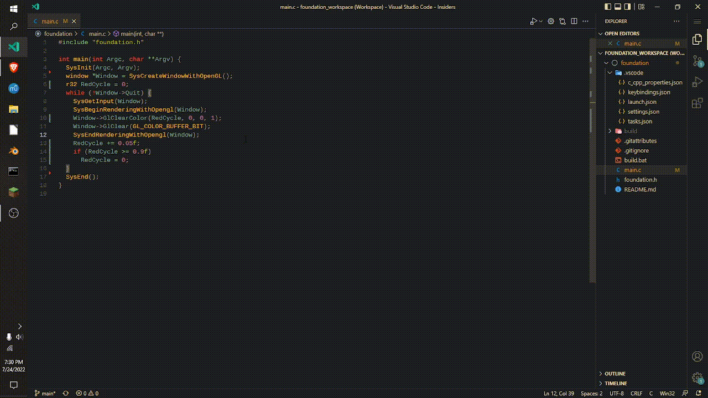

# Foundation
This is the scaffold for making real-time and single execution programs in C in windows (no other OSs suported yet). This projects reuses and adapts code from https://github.com/Mr-4th-Programming/mr4th, https://github.com/vurtun/tau and https://youtu.be/NG_mUhc8LRw.

Example program:
```C
//.note: This define and include pair must be after all headers!
#define FOUNDATION_IMPLEMENTATION
#include "foundation.h"

int main(int Argc, char **Argv) {
  SysInit(Argc, Argv);
  window     *Wnd = WndInit(gfx_api_Opengl, 0, 0, -1, -1);
  opengl_api *Gl  = cast(opengl_api*, Wnd->GfxApi);

  r32 Red = 0.f;

  while (!Wnd->Finish) {
    WndBeginFrame(Wnd);
      Gl->ClearColor(Red = (Red >= 0.9)? 0 : Red+.05f, 0, 0, 1);
      Gl->Clear(GL_COLOR_BUFFER_BIT);
    WndEndFrame(Wnd);
  }

  WndEnd(Wnd);
  SysEnd();
}
```

